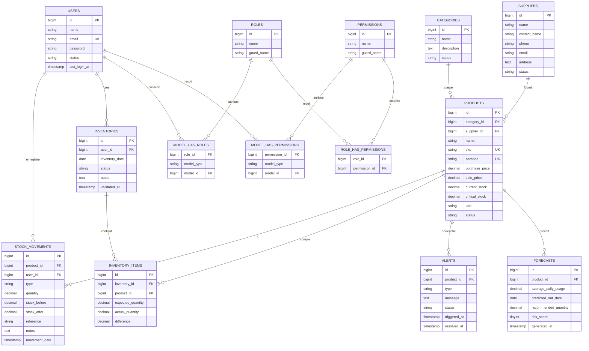

# Schema de base de donnees StockFlow

Document genere pour visualiser les tables principales, leurs relations et les relations N,N.

## Vue relationnelle



## Lecture rapide des relations

### Catalogue

- Une categorie possede plusieurs produits.
- Un fournisseur possede plusieurs produits.
- Un produit appartient a une categorie.
- Un produit appartient a un fournisseur.

### Stock

- Un produit possede plusieurs mouvements de stock.
- Un utilisateur enregistre plusieurs mouvements.
- Un mouvement appartient a un produit et a un utilisateur.
- Les mouvements sont des evenements immutables : ils conservent `stock_before` et `stock_after`.

### Inventaires

- Un utilisateur cree plusieurs inventaires.
- Un inventaire contient plusieurs lignes d'inventaire.
- Une ligne d'inventaire concerne un produit.
- Une ligne garde la quantite attendue, la quantite observee et l'ecart.

### Alertes et previsions

- Un produit possede plusieurs alertes dans le temps.
- Un produit possede plusieurs previsions dans le temps.
- L'application utilise surtout la derniere prevision par produit pour l'affichage.

### Roles et permissions

- Les tables `roles`, `permissions`, `model_has_roles`, `model_has_permissions` et `role_has_permissions` viennent de Spatie Laravel Permission.
- `model_has_roles` rattache des roles aux modeles, ici principalement aux utilisateurs.
- `role_has_permissions` rattache les permissions aux roles.
- `model_has_permissions` permettrait d'attribuer des permissions directement a un utilisateur, meme si le fonctionnement principal passe par les roles.

## Relations N,N

### Utilisateurs N,N Roles

Tables :
- `users`
- `roles`
- pivot : `model_has_roles`

Relation :

```text
users N,N roles
```

Utilisation :
- un utilisateur peut avoir plusieurs roles ;
- un role peut etre attribue a plusieurs utilisateurs.

Dans StockFlow, les roles metier sont :
- Administrateur ;
- Gestionnaire ;
- Magasinier.

### Roles N,N Permissions

Tables :
- `roles`
- `permissions`
- pivot : `role_has_permissions`

Relation :

```text
roles N,N permissions
```

Utilisation :
- un role contient plusieurs permissions ;
- une permission peut appartenir a plusieurs roles.

Exemple :
- `products.view` appartient a Administrateur, Gestionnaire et Magasinier.
- `roles.manage` appartient seulement a Administrateur.

### Utilisateurs N,N Permissions directes

Tables :
- `users`
- `permissions`
- pivot : `model_has_permissions`

Relation :

```text
users N,N permissions
```

Utilisation :
- Spatie permet d'attribuer des permissions directement a un utilisateur.
- Dans l'application actuelle, le modele recommande reste l'attribution par role.

### Inventaires N,N Produits

Tables :
- `inventories`
- `products`
- table associative : `inventory_items`

Relation :

```text
inventories N,N products
```

Utilisation :
- un inventaire peut contenir plusieurs produits ;
- un produit peut apparaitre dans plusieurs inventaires ;
- la table associative porte des donnees metier :
  - `expected_quantity`
  - `actual_quantity`
  - `difference`

Cette relation n'est pas une simple table pivot technique : `inventory_items` est une vraie table metier.

### Produits N,N Utilisateurs via mouvements

Tables :
- `products`
- `users`
- table associative evenementielle : `stock_movements`

Relation :

```text
products N,N users
```

Utilisation :
- un produit peut etre manipule par plusieurs utilisateurs ;
- un utilisateur peut manipuler plusieurs produits ;
- la table `stock_movements` conserve chaque operation :
  - type de mouvement ;
  - quantite ;
  - stock avant ;
  - stock apres ;
  - reference ;
  - date.

Cette relation est une relation N,N historique/evenementielle, pas une simple association statique.

## Relations 1,N principales

| Parent | Enfant | Sens |
|---|---|---|
| categories | products | une categorie classe plusieurs produits |
| suppliers | products | un fournisseur fournit plusieurs produits |
| products | alerts | un produit peut declencher plusieurs alertes |
| products | forecasts | un produit peut avoir plusieurs previsions |
| products | stock_movements | un produit a plusieurs mouvements |
| users | stock_movements | un utilisateur enregistre plusieurs mouvements |
| users | inventories | un utilisateur cree plusieurs inventaires |
| inventories | inventory_items | un inventaire contient plusieurs lignes |
| products | inventory_items | un produit peut etre compte dans plusieurs inventaires |

## Contraintes importantes

- `products.sku` est unique.
- `products.barcode` est unique quand il est renseigne.
- `inventory_items` a une contrainte unique sur `inventory_id + product_id`.
- Les suppressions physiques sont evitees dans les usages metier.
- Les produits, categories et fournisseurs utilisent plutot un statut `active` / `archived`.
- Les utilisateurs utilisent un statut `active` / `disabled`.
- Les mouvements de stock sont conserves comme journal d'audit.

## Tables techniques Laravel

Ces tables existent aussi dans la base, mais ne portent pas directement la logique metier StockFlow :

- `sessions`
- `cache`
- `cache_locks`
- `jobs`
- `job_batches`
- `failed_jobs`
- `password_reset_tokens`

Elles servent a Laravel pour les sessions, le cache, les files de jobs et les mecanismes d'authentification.
